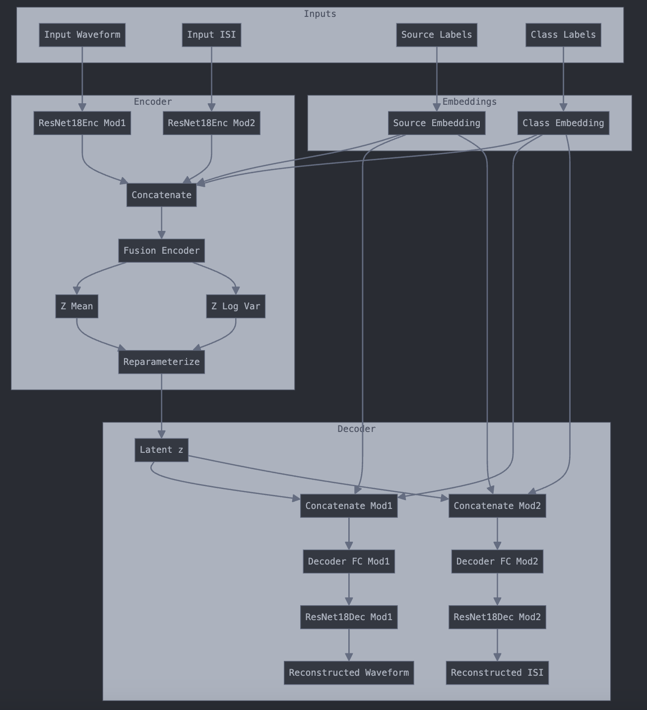

# HIPPIE

High-dimensional Interpretation for Physiological Patterns in Intercellular Electrophysiology (HIPPIE), a cVAE framework designed for multimodal neuron classification and clustering by integrating extracellular action potential waveforms with spike-timing derived measurements.


## To install HIPPIE

```bash
# Clone this repository
git clone https://github.com/braingeneers/Hippie

# cd into the repo parent folder
cd Hippie
# Create a conda environment with python 3.10
conda create --name hippie python=3.10
# Activate the environment
conda activate hippie

# Install the repo
pip install .
```

Installation should take less than 5 minutes in a normal desktop computer.

The packages required are described in the pyproject.toml and requirements.txt file and they are:
pandas,numpy,matplotlib,scikit-learn,pytorch-lightning,wandb and seaborn.

## To train a HIPPIE model. 

Add the data you want to use to train your model as a new folder in the ./datasets folder. Follow the stablished naming convention

Starting from the parent folder run the training script with the following parameters:

- `z_dim` (Latent space dimensionality) = 10
- `weight-decay` = 0.01
- `learning-rate` = 0.001
- `beta` (Weight of the KL divergence term) = 0.5
- `dataset` (Dataset folder) = cellexplorer-celltype
- `upload-model` (Flag to upload the model to a remote server)
- `wandb-tag` (Tag for Weights & Biases logging) = no_curr_sup_pretrain_data
- `project` (Project name for Weights & Biases) = "HIPPIE final benchmarks w finetune without labels"
- `finetune-without-labels` (Flag to finetune without labels) = True
- `pretrain-max-epochs` (Maximum epochs for pretraining) = 1
- `finetune-max-epochs` (Maximum epochs for finetuning) = 1
- `supervised-max-epochs` (Maximum epochs for supervised training) = 1
- `batch-size` (Batch size for training) = 512
- `supervised-batch-size` (Batch size for supervised training) = 64
- `early-stopping-patience` (Patience for early stopping) = 30
- `gradient-clip-val` (Gradient clipping value) = 1.0
- `train-val-split` (Train-validation split ratio) = 0.8
- `finetune-split` (Finetune split ratio) = 0.1
- `limit-train-batches` (Limit the number of training batches) = None
- `limit-val-batches` (Limit the number of validation batches) = None


```bash
python scripts/train_model_with_multimodal.py --z_dim 10 --weight-decay 0.01 --learning-rate 0.001 --beta 0.5 --dataset cellexplorer-celltype --upload-model --wandb-tag no_curr_sup_pretrain_data --project "HIPPIE final benchmarks w finetune without labels" --finetune-without-labels True --pretrain-max-epochs 1 --finetune-max-epochs 1 --supervised-max-epochs 1 --batch-size 512 --supervised-batch-size 64 --early-stopping-patience 30 --gradient-clip-val 1.0 --train-val-split 0.8 --finetune-split 0.1

```
## To get the embeddings and perform inference 

From trained models and dataset without labels

```bash
python inference_from_trained_model.py --dataset cellexplorer-celltype \
                   --checkpoint path/to/model_checkpoint.ckpt
                   --output-dir ./embeddings_results
```

The outputs for training and inference are the trained models as .ckpt files and the embeddings of the test files as csv files.

Training a new model and using it for inference should take around 45 minutes in a common computer with a consumer grade GPU.